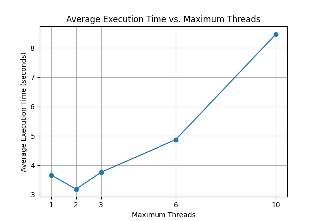

# Prime Number Checker using Thread Pool with Hazard Pointers

## Overview
This project implements a multi-threaded prime number checker using a thread pool and hazard pointers for safe memory reclamation. The program reads integers from standard input, checks each number for primality using the Miller-Rabin test, and counts the total number of prime numbers found. The Michael Scott Queue Algorithm is a lock-free concurrent queue algorithm designed to allow multiple threads to enqueue and dequeue elements without the need for locks, which can lead to contention and performance degradation in highly concurrent scenarios.

# Michael-Scott Algorithm and CAS

## Overview
The Michael-Scott (MS) queue algorithm is a lock-free implementation of a concurrent queue, using Compare-And-Swap (CAS) operations to ensure thread safety and consistency without traditional locking mechanisms.

## Compare-And-Swap (CAS)
CAS is an atomic instruction used to achieve synchronization in concurrent algorithms. It compares the current value of a memory location to an expected value and, only if they match, swaps it with a new value. This ensures that the update happens only if no other thread has modified the value since it was last read, providing a way to handle concurrent updates safely.

### CAS in MS Queue
In the MS queue, CAS is used to manage the head and tail pointers of the queue:

- **Dequeue Operation**: CAS ensures that the head pointer is updated atomically, maintaining consistency when removing nodes.

## Implementation Details
In my implementation, the dequeue operation is made thread-safe using CAS, allowing multiple threads to safely remove nodes from the queue concurrently. However, the enqueue operation is not made thread-safe because, in the context of the thread pool, only a single thread is responsible for pushing tasks onto the queue, while multiple worker threads are responsible for pulling tasks off the queue.

## Comparison: Traffic Light vs. Circle
- **Traffic Light (Locks)**: Traditional locking mechanisms can be compared to a traffic light at an intersection. Each thread (car) must wait for its turn to proceed, which can lead to delays (blocking) and potential deadlocks (traffic jams).
- **Circle (Lock-Free with CAS)**: The MS queue with CAS is akin to a roundabout (circle) where cars enter and exit smoothly without stopping. Each car (thread) checks for a free spot and proceeds without waiting for a signal, leading to more fluid and efficient traffic flow.

The MS queue using CAS for the dequeue operation allows for high concurrency and reduced contention, making it an effective choice for performance-critical applications in multi-threaded environments.


# Memory Usage Limitation with a Single Lock
In this project, a single lock mechanism is utilized to restrict the size of memory usage within a concurrent queue implementation. The goal is to prevent the queue from exceeding a specified maximum size (`QUEUE_MAX_SIZE`), thereby avoiding excessive memory consumption and potential performance degradation. this is limiting the **memory usage to 2MB only**. 

in the picture we can see 1000M run that took more than 8 minuets but consumed 2048 KB only (under the maxresident).
### Implementation Approach
- **Atomic Size Management**: Every time a new node is added to the queue, the current size of the queue is atomically incremented.
- **Blocking on Size Limit**: When the size reaches `QUEUE_MAX_SIZE`, a thread acquires a lock to enter a critical section. Within this section, the thread waits on a condition variable until the queue size drops below the maximum threshold.
- **Signaling for Resumption**: During dequeuing operations, when the queue size decreases to a predefined fraction (`QUEUE_MAX_SIZE / 3`), a single thread signals the main thread to resume enqueue operations.


This approach effectively balances the need for concurrent access and memory management in a concurrent queue scenario, providing robustness and efficiency in handling concurrent tasks.

# Hazard Pointers Implementation

## Overview
Hazard pointers are used for safe memory reclamation in lock-free data structures. They ensure that memory referenced by other threads is not prematurely freed, preventing use-after-free errors.

## Implementation Summary
1. **Initialization**:
   - Allocate hazard pointers for each thread.
   - Each thread has a fixed number of hazard pointers (`MAX_HAZARD_POINTERS`) 2 in my case.

2. **Marking Hazard Pointers**:
   - Threads mark nodes they are accessing by storing pointers in their hazard pointer slots.
   - This indicates that the node is in use and should not be reclaimed.

3. **Retiring Nodes**:
   - Nodes that are no longer needed are added to a thread-local retired list.
   - When the retired list reaches a threshold (`RETIRE_THRESHOLD`), the thread scans for nodes safe to free.

4. **Scanning and Reclamation**:
   - During scanning, check retired nodes against all hazard pointers.
   - Free nodes not marked by any hazard pointers, ensuring they are not in use by any thread.

5. **Cleanup**:
   - Free remaining retired nodes and hazard pointer structures during cleanup.


This screenshot demonstrates a successful run of the program with Valgrind, showing no memory leaks detected. It verifies that the memory management within the implementation is robust and free of leaks.

Hazard pointers provide a robust mechanism for managing memory in concurrent programs, ensuring safe and efficient execution.


## Files
- `main.c`: Contains the main logic of the program, including initialization of thread pool, reading input, and invoking prime checking tasks.
- `thread_pool.h`, `thread_pool.c`: Implements a thread pool to manage worker threads that perform prime number checks.
- `MSqueue.h`, `MSqueue.c`: Defines a lock-free queue using Michael Scott Queue Algorithm using hazard pointers for thread-safe task management. 
- `hazard_pointer.h`, `hazard_pointer.c`: Implements hazard pointers for safe memory reclamation in a lock-free environment.
- `Makefile`: Contains build instructions for compiling the project.


## Build Instructions
To build the project, run 
```bash
make
``` 
from the command line. 

1. **Generate Random Numbers:**
   ```bash
   ./randomGenerator <seed> <amount_of_numbers>
   ```
- Replace <seed> with an integer seed value for the random number generator.
- Replace <amount_of_numbers> with the desired number of random numbers to generate.

2. **Count Prime Numbers:**
```bash
./primeCounter <number_of_threads>
```
- Replace <number_of_threads> with the number of threads to be used for counting prime numbers.

For instance, to generate 100,000 random numbers using a seed of 10 and then count prime numbers, execute:

```bash
./randomGenerator 10 100000 | ./primeCounter 
```
./primeCounter 
by default is the number_of_threads will be the number of the cores in your cpu minus one.


## Performance

this done by python script to compare the running times between the naive implementation and ours.


checking the desired number of threads.
- **Concurrency**: Utilizes multiple threads to distribute the workload efficiently across available CPU cores.
- **Memory Management**: Ensures safe memory reclamation using hazard pointers, minimizing memory leaks in a concurrent environment.

## Future Improvements
- **Performance Optimization**: Fine-tuning the number of threads and queue size for optimal performance on different hardware configurations.
- **Extended Functionality**: Adding support for larger number ranges or integrating with external systems for distributed prime checking.

## References
The project is inspired by concepts from concurrent programming and safe memory management techniques, particularly hazard pointers.

to manage doing hazard pointers I have read and got help from this article:
 Hazard Pointers: 
 Safe Memory Reclamation for Lock-Free Objects by Maged M. Michael 

